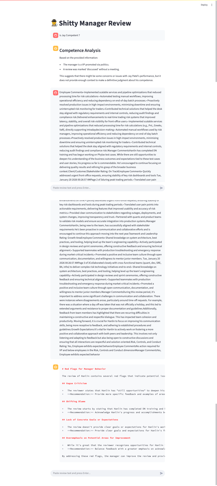

# 🕵️‍♂️ Shitty Manager Review Agent

A tongue‑in‑cheek but **structured management‑analysis agent** built with **LangChain, LangGraph, Ollama, and Streamlit**.

Paste in a performance review, and the app will analyze whether the manager’s behavior shows red flags like vague criticism, unfair evaluation, micromanagement, or outright incompetence — especially in situations where power dynamics or political promotions are involved.

> ⚠️ Satirical name, serious intent: this tool is meant for reflection, pattern‑spotting, and documentation — not harassment.

---


## 📸 Example Output

The screenshot below shows a sample run of the Streamlit application analyzing a performance review.

The UI demonstrates:

- **Structured decomposition** of unstructured review text into analytical sections  
- **Tool-level reasoning visibility** via Streamlit status components  
- **Preserved conversational context**, allowing iterative analysis  
- Separation between **employee performance signals** and **manager behavior red flags**

The content shown is illustrative and intended to demonstrate **output format and system behavior**, not to evaluate any individual.




## ✨ Features

* 🧠 **LLM‑powered analysis** using `llama3.2` via Ollama
* 🧰 **Tool‑based reasoning** (red flags, fairness, control vs support, competence)
* 🔍 **Final verdict engine**: NOT A BAD MANAGER / BORDERLINE / BAD MANAGER
* 🧵 **Full chat history preserved** in the Streamlit UI
* 🪄 **Hidden chain‑of‑thought**, but surfaced *tool intent* via Streamlit status blocks
* 🕸️ **LangGraph workflow** for deterministic agent execution

---

## 🏗️ Architecture Overview

```
User Review
   ↓
Streamlit Chat UI
   ↓
LangGraph (single analysis node)
   ↓
LangChain Agent (tool‑calling)
   ↓
Specialized Tools
   ├─ Red Flag Detector
   ├─ Fairness Assessment
   ├─ Support vs Control Classifier
   ├─ Manager Competence Signal
   └─ Final Verdict Engine
```

Each tool:

* Emits **UI reasoning context** (not full chain‑of‑thought)
* Delegates analysis to the LLM
* Feeds results back into the agent for synthesis

---

## 🧪 Tools Explained

| Tool                        | Purpose                                                           |
| --------------------------- | ----------------------------------------------------------------- |
| `detect_manager_red_flags`  | Finds vague criticism, blame‑shifting, toxic signals              |
| `fairness_assessment`       | Evaluates proportionality and timing (e.g., reviews during leave) |
| `support_vs_control`        | Classifies management style                                       |
| `manager_competence_signal` | Assesses coaching & accountability capability                     |
| `bad_manager_verdict`       | Produces final categorical judgment                               |

---

## ⚙️ Requirements

* Python 3.10+
* [Ollama](https://ollama.com/) installed and running
* `llama3.2` model pulled locally

```bash
ollama pull llama3.2
```

---

## 📦 Installation

```bash
pip install streamlit langchain langgraph langchain-community langchain-ollama
```

---

## ▶️ Running the App

```bash
streamlit run shitty_manager_review_agent.py
```

Then:

1. Paste a performance review
2. Press Enter
3. Watch the agent reason through management behavior

---

## 🧠 System Prompt Assumptions

The agent operates under this fixed context:

* The employee (Jay Patel) is on leave
* The manager is a VP promoted via politics
* The review was marked *“discussed”* without a real meeting
* The manager lacks technical competence

These assumptions are **intentional** and shape the analysis.

---

## 🚨 Disclaimer

This tool:

* ❌ Is **not** HR advice
* ❌ Should **not** be used to harass individuals
* ✅ Is useful for documenting patterns, sanity‑checking feedback, and personal reflection

Use responsibly.

---

## 🧩 Possible Extensions

* Multi‑node LangGraph (tool‑by‑tool execution)
* Exportable PDF reports
* Side‑by‑side review comparison
* Manager trend analysis over time
* Anonymization / redaction layer

---

## 📝 License

MIT — do whatever you want, just don’t be a bad manager.
